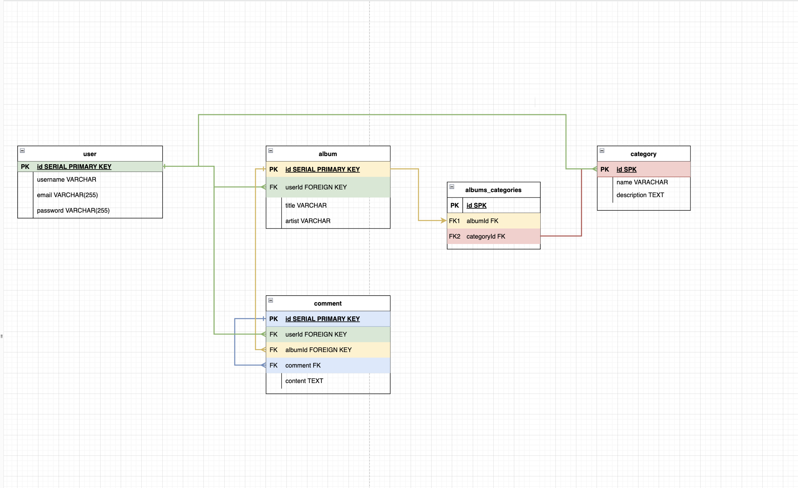
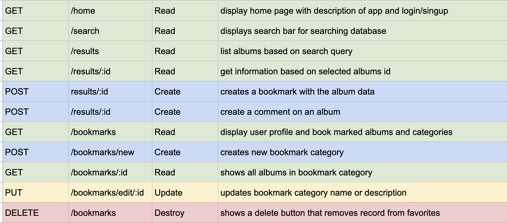
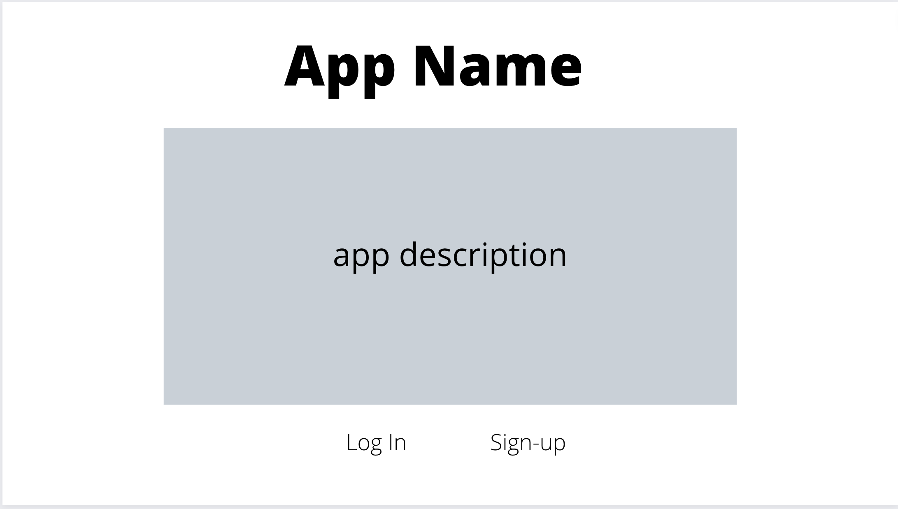
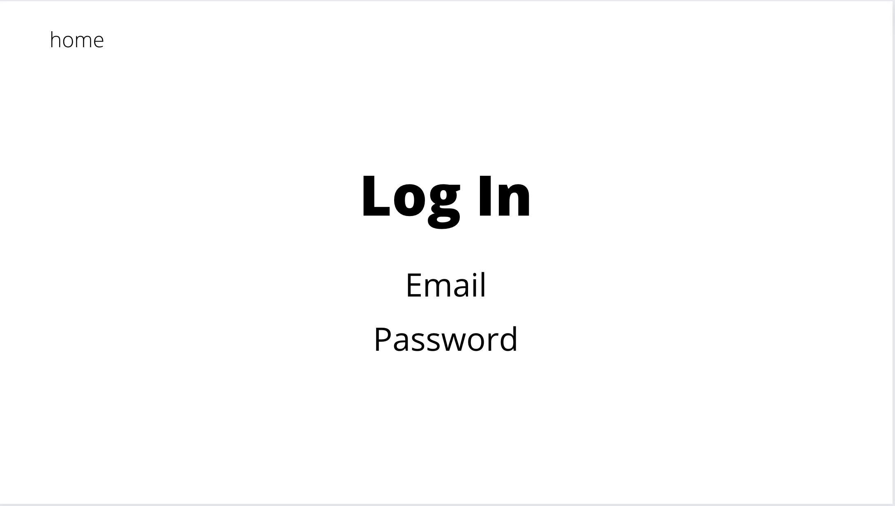
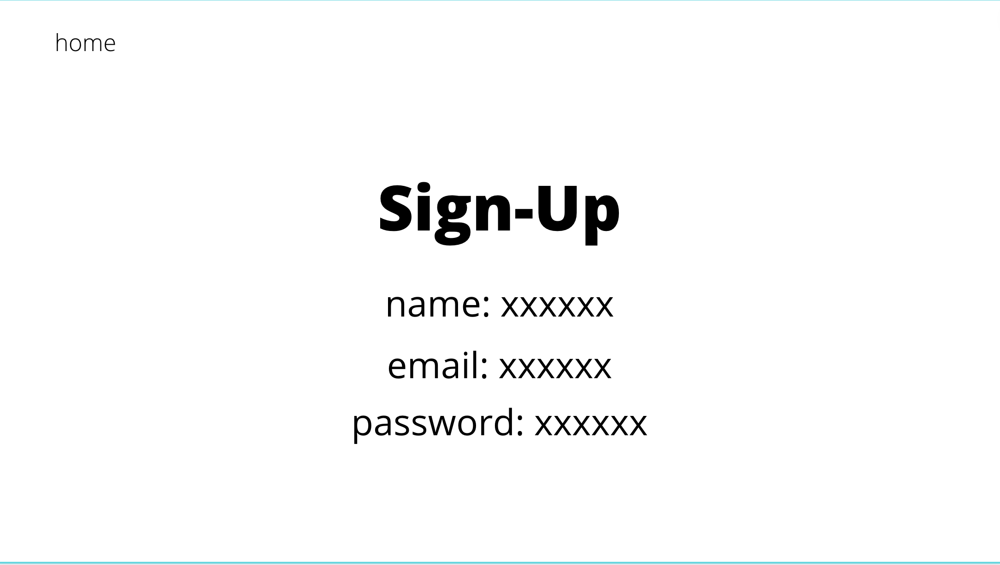
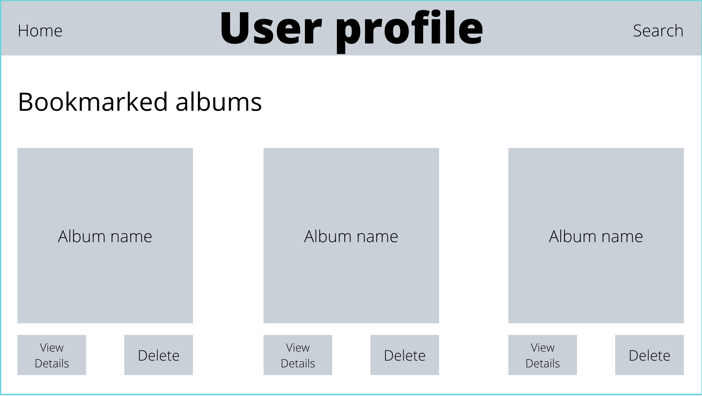
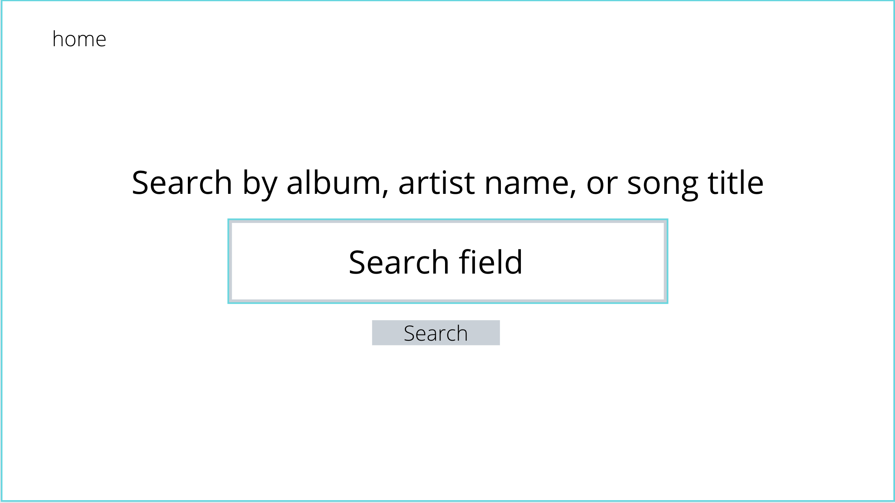
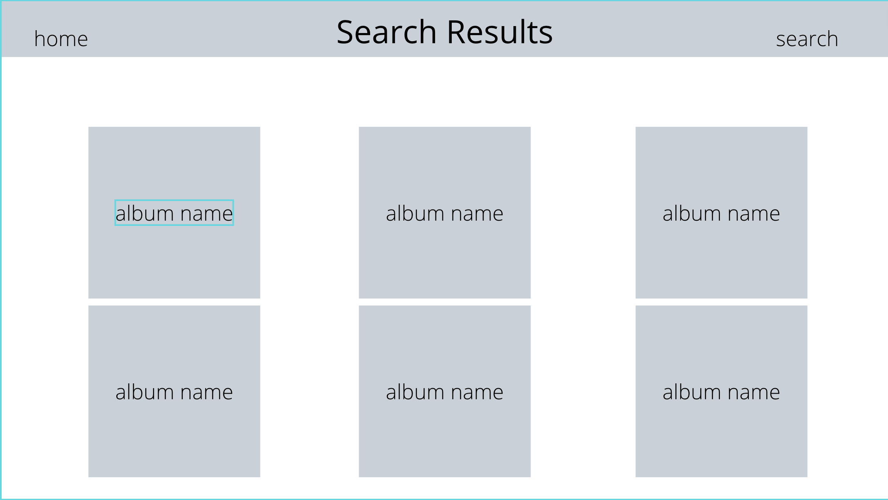
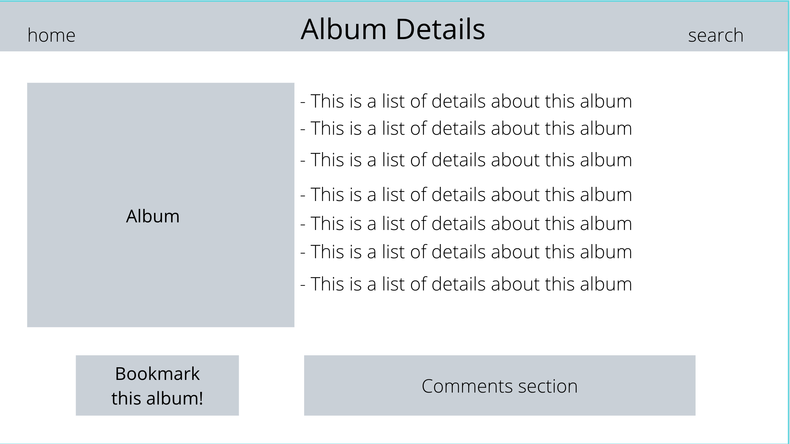

# Unit 2 Project - Side-Side: a virtual record collection 

Side-Side is a music database and organization app in which a user can get information on recordings by artist name, record title, or song title using the Discogs Api. Users may view an albums information such as credits and track listing. Users are also able to bookmark and categorize records, adding them to a want-list or their growing collection.

## Deployed Project
(link here)

## Technologies
- Postgres
- Express, Ejs
- Node.js
- CSS

## ERDS

## RESTful Routing Chart

## Wireframes
/

/login

/signup

/bookmarks

/search

/results

/results/:id

## User Stories
1. I want to be able to see a list of albums based on my search of album title, song title, or artist.
2. I want to be able to see a selected albums information and credits.
3. I want to be able to view comments and make comments on albums.
4. I want to be able to add albums to a list of bookmarks that I can categorize.

## MVP Goals
- Retrieve information from the Discogs Api and display it in seperate views
- Be able to search for database an artist
- Be able to see artists albums and link to album info
- Create a collection page for storing bookmarked albums
- Be able to create categories in order to sort albums in collection
- Give users option to delete records from collection and edit categories

## Stretch Goals
- add comment/social media functionality 
- links to actual music
- ability to rearrange record collection
- be able to bookmark artists and songs 
- display album story and or long form reviews

## Resources
- https://www.discogs.com/developers
