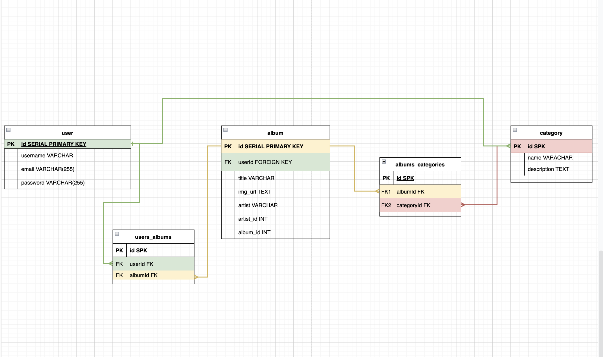
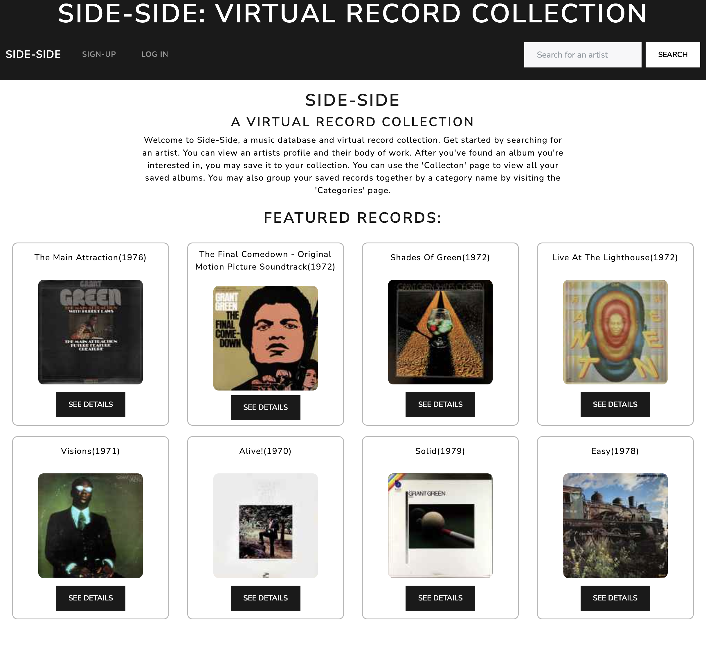

# Side-Side: a virtual record collection 

Side-Side is a music database and organization app in which a user can get information on recordings by artist name, record title, or song title using the Discogs Api. Users may view an albums information such as credits and track listing. Users are also able to bookmark and categorize records, adding them to a want-list or their growing collection.

## Deployed Project
https://side-side.herokuapp.com/

## Technologies
- Postgres
- Express, Ejs
- Node.js
- CSS

## ERDS

## RESTful Routing Chart
<!--  -->

| VERB | URL pattern | Action | Description |
|------|-------------|--------|-------------|
| GET  | /           | Read   | display home page with description of app |
| GET  | /users/login          | Read   | display login form |
| GET  | /users/new         | Read   | display sign up form |
| POST  | /users/new          | Create | Create new user from form |
| GET  | /users/profile        | Read  | display user profile/collection |
| GET  | /users/profile        | Read  | display user profile/collection |
| GET  | /artists/:id       | Read  | display searched artist results|
| GET  | /albums/:id       | Read  | display artists albums |
| DELETE | /albums/:albumid       | Delete  | delete album from user collection |
| GET  | /categories      | Read | display all user categories |
| POST  | /categories      | Create | display form to create new album category |
| POST | /categories/albums      | Create | add album to a selected category|
| GET| /categories/new    | Read | display form to create new category|
| GET| /categories/:id    | Read | display category and associated albums|
| GET| /categories/edit:id  | Read | display from to edit category|
| PUT | /categories/:id    | Update | updates category name and description in database|
| DELETE | /categories/:categoryId    | Delete | Delete category |

## Screenshots
Home page

Artist page

Artists Profile

Artist Albums

Collection

Categories

Albums Categories

<!-- 

/search

/results

/results/:id
  -->

## User Stories
1. I want to be able to see a list of artist based on my search of artist.
2. I want to be able to see a selected artist albums information and credits.
3. I want to be able to add albums to a list of bookmarks that I can categorize.

## MVP Goals
- Retrieve information from the Discogs Api and display it in seperate views
- Be able to search for database an artist
- Be able to see artists albums and link to album info
- Create a collection page for storing bookmarked albums
- Be able to create categories in order to sort albums in collection
- Give users option to delete records from collection and edit categories

## Stretch Goals
- add comment/social media functionality 
- links to actual music
- ability to rearrange record collection
- be able to bookmark artists and songs 
- display album story and or long form reviews

## Resources
- https://www.discogs.com/developers
